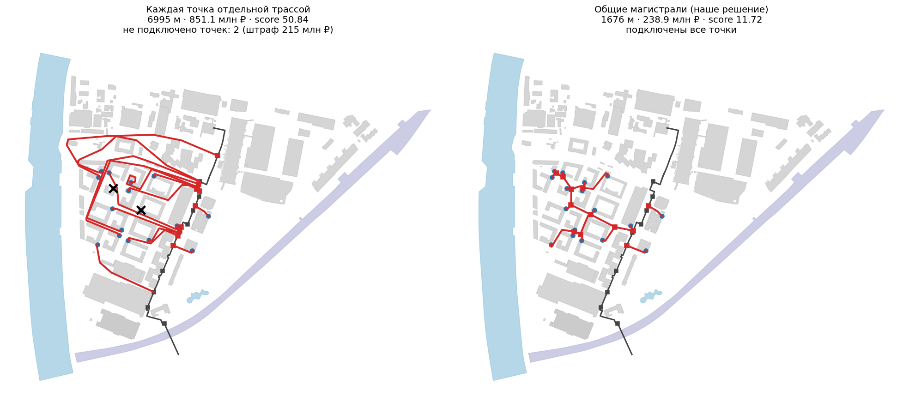

# Описание решения

## Задача и целевая функция

На входе — GeoJSON района: существующая тепловая сеть с диаметрами, тепловые камеры, точки
подключения ОКС с расходом и пространственные ограничения. На выходе — до трёх содержательно разных
вариантов новой сети: участки с диаметром, расходом, способом прокладки и стоимостью, камеры,
технические узлы и сводка с рангом.

Варианты ранжируются по `score = 0.7 · C / 25 000 000 + 0.3 · L / 100`, меньше — лучше.
Порядок величин задаёт всю инженерную логику:

- камера стоит 3–12 млн ₽ — это 24–28 м трубы, поэтому лишняя камера окупается только если срезает
  хотя бы столько же метров;
- не подключить точку стоит 100 млн ₽ плюс 500 тыс. за каждую т/ч, поэтому обход в сотню метров
  всегда выгоднее отказа.

Отсюда главная идея: оптимизировать не длину и не стоимость по отдельности, а их связку — объединять
точки в магистрали, но не плодить камеры.

## Почему такой подход

**Граф видимости, а не сетка.** Описание кейса упоминает шаг сетки 3 м, но сетка привязывает трассу к
своим направлениям и даёт лишние повороты, а §2.1 требует обратного — минимум поворотов и никаких
мелких изломов. Граф видимости по вершинам зон отступа даёт любые углы, точную длину и прозрачную
стоимость ребра. Полный граф всех пар не строится: соседи ищутся через STRtree, видимость проверяется
лениво и переспрашивается при смене ДУ. Растровый поиск оставлен запасным режимом и по умолчанию
выключен — на плотной реальной застройке его трассы не проходят валидатор.

**Жадный Штейнер с общими магистралями, а не отдельная трасса на каждую точку.** Классическая задача
Штейнера минимизирует длину, а здесь целевая функция другая: при объединении растут ДУ, появляются
камеры-разветвления, меняются врезки. Поэтому цена цели считается по формуле score — длина плюс
камера плюс удорожание магистрали выше по потоку, — а не по геометрической длине.

**Перебор порядков вместо одной «правильной» эвристики.** Результат жадного построения сильно зависит
от порядка подключения точек, и заранее лучший порядок неизвестен. Гоняются базовые порядки, затем
детерминированно-случайные, затем вариации двух лучших. Бюджет задан в проверках отрезков — число
построенных вариантов одинаково на любой машине.

**Независимый валидатор как часть решения, а не как тест.** Отдельная реализация правил читает готовый
GeoJSON и проверяет его целиком. Это ловит регрессии, позволяет сравнивать стратегии по одной системе
проверок и даёт проверяющему отчёт вместе с результатом.

## Сколько даёт объединение в магистрали

Базовая линия посчитана той же программой (`-Dstrategies=naive`, в обычный перебор не входит):

| | Длина | Стоимость | Врезок | Не подключено | score |
|---|---|---|---|---|---|
| Каждая точка отдельной трассой | 6 995 м | 851.1 млн ₽ | 5 | 2 точки (штраф 215 млн ₽) | 50.84 |
| Общие магистрали | **1 673 м** | **238.7 млн ₽** | 0 | **нет** | **11.70** |

Выигрыш — в 4.3 раза по score: 5.3 км трубы и 612 млн ₽. Наивная раскладка вдобавок не дотягивается
до двух точек: отдельные трассы занимают коридоры между домами, и соседям места уже не остаётся.



## Алгоритм

Платформа валидирует исходный FeatureCollection и передаёт JTS-геометрии в EPSG:32637 интерфейсу
`RoutingEngine.solve(InputModel, SolveOptions)`. Ядро работает так:

1. **Подготовка.** Правила берутся из профиля ресурса (`profiles/heat.yml`; есть `water` и `cable`).
   Для входов масштаба города расчёт ограничивается областью интереса (охват точек, ближайшая сеть,
   запас). Для каждого ДУ строится карта препятствий: зоны отступа (отступ плюс половина габарита пары
   труб), спецзоны спецпроходов, STRtree и растровый предфильтр. Маршруты ищутся по картам групп ДУ,
   проверки результата — всегда по точному ДУ.
2. **Подход к зданию (§2.2).** Для точки внутри полигона строится точка входа на границе зоны отступа
   по лучу из точки к ближайшей границе; отступы к содержащим, наложенным и пристроенным полигонам
   исключаются, к другим корпусам — нет. Если через ближайшую границу пути нет или обход длиннее
   альтернативы и в 2 раза, и на 30 м — берётся другая стена, и это пишется в property `approach`.
3. **Дерево.** Точки подключаются по очереди; для каждой A* по графу видимости ищет дешевейший путь до
   существующей сети (врезка в камеру не далее 10 м либо новая камера на участке) или до уже
   построенного дерева (точка на ребре → камера-разветвление). В стоимость цели входит камера и
   удорожание магистрали выше по потоку из-за роста ДУ; за поворот назначен штраф.
4. **ДУ и ремонт.** Расходы суммируются от листьев к врезке, ДУ подбирается по расходу и предельной
   длине: если минимальный по расходу не проходит по длине, поднимается ДУ всей непрерывной части с
   неизменным расходом, и так до сходимости. Рост габарита может нарушить отступ — сеть проверяется,
   нарушающие рёбра перекладываются, дерево строится в несколько проходов с подсказками ДУ.
5. **Локальная оптимизация.** Переподключение точки, перенос врезки магистрали, перенос поддерева,
   сдвиг камеры разветвления во взвешенную точку Ферма. Принимается только улучшение score.
6. **Перебор.** Базовые стратегии (по расходу, ближние и дальние первыми), детерминированно-случайные
   порядки, вариации лучших найденных порядков. Бюджет — в проверках отрезков, поэтому результат не
   зависит от скорости машины.
7. **Полировка.** Удаление лишних вершин, сжатие вершин поворота к прямой между соседями, приведение
   углов к 45°/90° — но только если это не удлиняет трассу и не добавляет поворотов. Результат
   перепроверяется; при появлении нарушения выполняется откат к трассе до полировки.
8. **Спецпроходы.** Пересечения разбиваются техническими узлами: границы отсчитываются вдоль оси новой
   сети, при наложении зон Kспец берётся максимальный и не перемножается, при смене набора
   пересекаемых объектов начинается новый участок. Спецучасток, дошедший до целевого здания,
   заканчивается в точке ОКС.
9. **Варианты.** До трёх содержательно разных: второй и третий выбираются с ограничением на совпадение
   трассы (не более 80 % длины в коридоре 3 м; выше 90 % вариант не включается вовсе), среди прочих
   предпочитаются недоминируемые по паре (стоимость, длина). Описание варианта говорит, где он
   присоединён, какие точки идут другой трассой и насколько он дороже и длиннее лучшего.

## Пространственные ограничения

Запреты — здания, парки, вода, железная дорога: трасса обходит их с отступом, зависящим от диаметра
(5, 7 или 9 м для ОКС) и от габарита пары труб. Железную дорогу пересекать нельзя, специального
прохода для неё нет.

Спецпроходы — дороги, трамвайные пути, газопровод, кабель, чужая теплосеть: пересечь можно, но одним
прямым участком, для дороги и трамвая под углом не менее 45° к оси препятствия, с коэффициентом от
1.05 до 1.75. На границах спецучастка ставится технический узел. При наложении зон коэффициент
максимальный, а не произведение.

Неизвестный тип ограничения трактуется консервативно — как запрет с отступом 1 м, и это пишется в
диагностику. Типы, отступы, коэффициенты и вертикальные просветы лежат в профиле-данных
(`src/main/resources/profiles/*.yml`), а не в коде: тот же движок считает под профилями водоснабжения
и кабелей.

## Режим с глубиной

`mode=DEPTH_3D` — отдельный запуск и отдельное ранжирование, с планом не смешивается. Ядро строит
профиль относительно горизонтальной поверхности, соблюдает уклон не круче 0.10 м/м и вертикальные
просветы, ставит технический узел на пересечении отметки 3.0 м. Стоимость наклонного участка
использует средний коэффициент глубины его концов; `k_depth` публикуется по округлённым глубинам,
попавшим в выдачу, поэтому стоимость в файле пересчитывается из него один в один.

Газ, кабель и чужую теплосеть решение пересекает сверху, пока остаётся просвет и глубина не меньше
0.7 м: при h ≤ 3 м Kгл = 1, то есть глубина не стоит ничего. Под дорогой и трамваем — только снизу,
как требует таблица. Выход остаётся плоским GeoJSON, глубины передаются атрибутами
`depth_start`/`depth_end`.

## Выходные данные

Один GeoJSON FeatureCollection на режим, WGS84. Объекты группируются по `variant_id`: `heat_network`,
`heat_chamber`, `technical_node`, `variant_summary`. Имена обязательных полей — по §7 Техприложения.
Ссылки `start_node_id`/`end_node_id` геометрически совпадают с концами линии. Новые идентификаторы:
`{variantId}_net_{n}`, `{variantId}_chamber_{n}`, `{variantId}_node_{n}`, `{variantId}_summary`.
Расстояния — метры горизонтальной проекции, расходы — т/ч, стоимость — рубли. Одна линия представляет
пару труб, расход не удваивается.

Дополнительные свойства объясняют расчёт: `k_special`, `k_depth`, `crossed`, `approach`, `turns`,
`serves_oks`, а в сводке — `validation_errors` и `validation_warnings`.

## Как проверена корректность

**Независимый валидатор.** Отдельная реализация всех правил Техприложения читает готовый GeoJSON и
проверяет каждый участок: отступы, углы, границы спецпроходов и Kспец, расходы, диаметры, предельную
длину, стоимость, глубину и просветы. Отчёт лежит рядом с результатом и доступен по
`GET /api/v1/jobs/{id}/validation`.

**Фаззинг на злой геометрии.** Генератор синтетических наборов умеет строить то, что ломает геометрию:
перекрывающиеся контуры зданий, трамвайные пути внутри полигона дороги, существующую трубу сквозь
здание, дорогу вплотную к фасаду, здание-каре с точкой во дворе, проходы ровно на грани проходимости.
Фаззинг нашёл и закрыл 21 настоящее нарушение правил — таких, которые глазами не видны; каждое закрыто
юнит-тестом.

**Воспроизводимость.** Бюджет перебора задан в проверках отрезков, а не в секундах: на 1, 2, 4 и 16
потоках получается один и тот же score. Выдача сервиса, поднятого через `docker compose up` на чистом
окружении, совпадает с файлом в репозитории побайтно — и в плане, и с глубиной.

**Мини-кейсы.** 12 маленьких наборов с заранее известным правильным ответом, по одному на правило:
пример из §7.3 Техприложения, обход здания, пересечение дороги, общая магистраль, двор-колодец,
предельная длина, территория школы, глубина под газопроводом, камера в радиусе 10 м, недостижимая
точка, диагональ трамвая, две точки в одном здании.

## Результаты

| Набор | Объектов | Точек | Время | score лучшего | Ошибок валидатора |
|---|---|---|---|---|---|
| Конкурсный датасет (ЗИЛ) | 144 | 17 | 20 с | **11.70** | 0 |
| Синтетика grid8 / city40 / city80 / grid14 | 194…11 531 | 30…120 | 37…160 с | 37.89 / 29.80 / 46.49 / 138.84 | 0 |
| OSM Москва: Преображенское / Ясенево / Шаболовка / Сокол | 490…2 852 | 25…60 | 23…63 с | 36.03 / 30.96 / 53.59 / 111.88 | 0 |

Неподключённые точки остаются только там, где маршрут по правилам действительно невозможен
(двор-колодец, здание внутри железнодорожной зоны). Это проверено независимо растровым поиском по
свободному пространству. Штраф считается по §2.5.

### Где проходит граница производительности

Время растёт не столько от числа точек, сколько от длины трасс через плотную застройку: дорогая
операция — A* по графу видимости, а он тем больше, чем больше препятствий между началом и целью.
Показательная пара: OSM Сокол — 2.6 км трасс, 2 852 объекта, 60 точек, 59 с; синтетика grid14 —
11 531 объект, 120 точек, 160 с.

Зависания невозможны: одно раскрытие A* ограничено `app.routing.max-expansions` (200 000), а весь
перебор — бюджетом в проверках отрезков. Вход до 3 ГБ разбирается потоково: 3 ГиБ за 27 с при пике
heap 204 МиБ, объекты читаются по одному, лишние атрибуты пропускаются.

## Границы применения

Это эвристика. Глобальная оптимальность не заявляется: дерево строится жадно, порядки подключения
перебираются, результат улучшается локально — доказать, что дешевле нельзя, мы не можем.

Независимый валидатор проверяет соблюдение правил, но не доказывает две вещи: что найденный вариант
оптимален и что для неподключённой точки маршрута действительно не существует.

Существующая сеть не реконструируется, её пропускная способность не проверяется — так требует
актуальное Техприложение.

Память ядра пропорциональна числу геометрических вершин, а не размеру файла: 3 ГиБ JSON не равны
3 ГиБ JTS. Для произвольно плотного трёхгигабайтного входа понадобился бы дисковый или тайловый
контракт — он не реализован.

При остром пересечении линейного объекта спецучасток продлевается до выхода из зоны отступа, то есть
получается длиннее формальных 2 м от точки пересечения. Иначе базовый участок сразу за спецпроходом
нарушал бы минимальное расстояние: при отступе 2.0 м, половине габарита ДУ200 0.44 м и половине
габарита газопровода 0.2 м выйти из зоны отступа за 2 м вдоль оси нельзя ни под каким углом.
Расхождение работает только в сторону удорожания, занизить стоимость оно не может.

## Воспроизведение итоговой выгрузки

`data/results/final/` — результат на конкурсном наборе: `dataset-PLAN_2D.geojson`,
`dataset-DEPTH_3D.geojson` и отчёты валидатора к ним. Воспроизводится через API или напрямую:

```bash
./mvnw package -DskipTests
java -Dloader.main=ru.lct.heat.io.PlatformCli -cp target/heat-routing-0.1.0-SNAPSHOT.jar \
  org.springframework.boot.loader.PropertiesLauncher \
  solve data/samples/dataset.geojson data/results/final/dataset-PLAN_2D.geojson
```

## Демонстрация

Веб-интерфейс открывается вместе с сервисом на <http://localhost:8080/>: принимает исходный GeoJSON,
сам запускает расчёт и показывает вход, результат, сравнение вариантов и отчёт валидатора на одной
странице. ТЗ интерфейса не требует и не оценивает его — это демонстрация, а не часть контракта.
Leaflet включён в образ и репозиторий с лицензией, интернет и тайлы не используются; предпросмотр
входа в браузере ограничен 50 МБ, файлы крупнее считаются через API. Автономный резервный
просмотрщик готовых файлов — `tools/viewer.html`.
